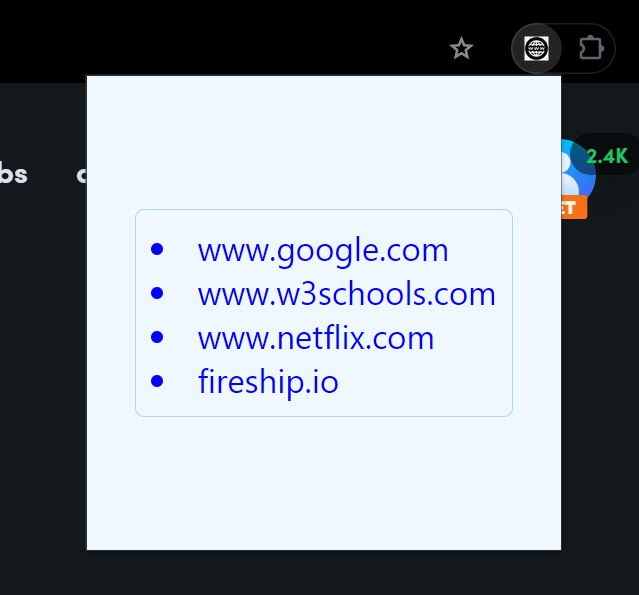

# Website Tracker Extension

This is a browser extension that allows users to track and monitor websites they visit.

## Installation

1. Clone this repository to your local machine.
2. Open your browser's extensions settings.
3. Enable developer mode.
4. Click on "Load unpacked" and select the extension directory.

## Usage

- Once installed, the extension will automatically track the websites you visit.
- You can view the tracked websites by clicking on the extension icon.

## Future Goals

- Add interaction with Google Sheets or other APIs to enable remote access to the visited website data.

## Contributing

Contributions are welcome! Please fork this repository and submit a pull request.